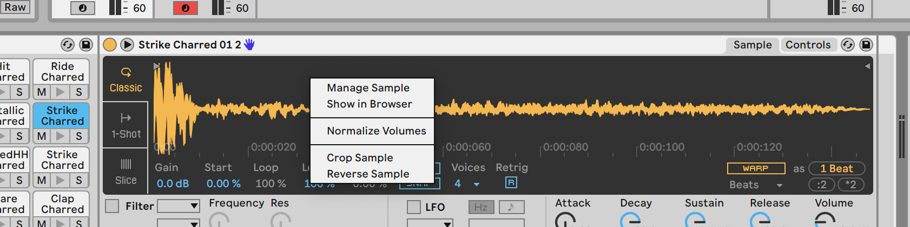

# Write simple beat from ableton packs
- install packs by dragging and dropping multiple alp files to the ableton window
- load a kit, write something

- Thought, "I want to make a melody from one of the hits"

# Make an instrument from raw sample.
## [Reference](https://www.youtube.com/watch?v=AVvGo4m2joM&t=77s)
- `shft cmd t` to make a new midi track
- `cmd f` to search
- Load **simpler**
- go to drum rack containing sample
- select sample and right click, `show in browser`

- click on simpler track
- drag and drop

- classic mode already selected makes sample chromatic along keyboard
- create midi clip by double clicking on clip next to drum clip

- you'll see piano roll where you can make your melody with new sample

done
